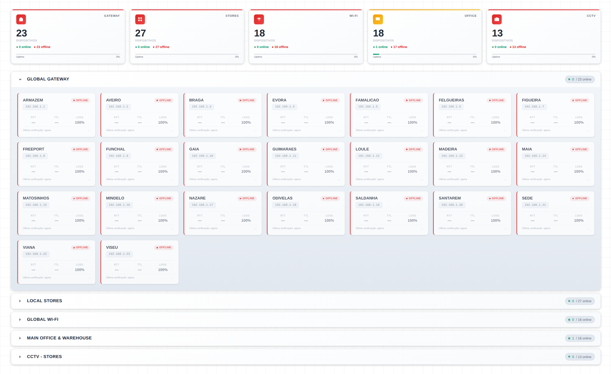

[](https://opensource.org/licenses/MIT) [](https://www.php.net/) [](https://developer.mozilla.org/en-US/docs/Web/JavaScript) [](https://www.w3.org/Style/CSS/Overview.en.html)

# Web Monitor Dashboard



A straightforward network monitoring dashboard. You configure your devices, and it pings them every 5 seconds to show you what's online, what's down, and how things are performing.

---

## What It Does

This dashboard monitors network devices and shows their status in real-time. Think of it as replacing the tedious process of manually pinging devices one by one. Instead, you get a live overview that updates automatically.

Each device shows whether it's online or offline, plus key metrics like RTT (latency), TTL, and packet loss. The interface is clean and gets straight to the point.

---

## The Interface

The dashboard is built around two main areas:

**Summary Cards** - At the top, you get quick stats for each category (Gateways, Stores, Wi-Fi, Office, CCTV). Each card shows total device count, how many are up or down, and an uptime percentage bar. Icons change color based on health: green when everything's good, yellow if there are some issues, red if things are down.

**Accordion Sections** - Click any category to expand and see individual devices. Each device card shows its name, IP, current status, and three metrics: RTT, TTL, and packet loss. Only one section expands at a time to keep things tidy.

The layout is responsive and works across different screen sizes, from phones to 4K displays. Everything fits on one screen without scrolling when collapsed.

---

## How It Works

The architecture is simple:

```
Browser
    index.php - renders the interface
    script.js - polls ping.php every 5 seconds
        ping.php - validates IPs against allowlist
        ping.php - executes parallel pings
        ping.php - returns JSON results
    script.js - updates the display
```

### Backend

The backend detects whether it's running on Windows or Linux and adjusts the ping commands accordingly. It runs pings in parallel batches of 6 using `proc_open()` to keep things fast. If that's not available, it falls back to sequential execution with `exec()`.

Ping results get parsed with regex to extract RTT and TTL values, then sent back to the frontend as JSON. The whole cycle repeats every 5 seconds.


---

## Project Structure

```
web-monitor/
    index.php
    ping.php
    config.php
    js/
        script.js
    css/
        style.css
    img/
        favicon.ico
        favicon.png
        32x32.png
        192x192.png
        screenshot.png
```

---

## Setup

### Requirements

- Windows or Linux (auto-detected)
- PHP 7.0+ with `proc_open()` and `exec()` enabled
- A web server (Apache, Nginx, IIS, etc.)

### Installation

```bash
git clone https://github.com/dapovoa/web-monitor.git
```

Edit `config.php` with your devices:
```php
$ipsGateways = [
    '192.168.1.1' => 'Main Gateway',
    '192.168.1.254' => 'Backup Gateway',
];

$ipsLojas = [
    '192.168.10.1' => 'Store Lisbon',
    '192.168.10.2' => 'Store Porto',
];
```

---

## Customization

**Polling interval** - Change it in `script.js`:
```javascript
setTimeout(fetchPingData, 5000);  // milliseconds
```

**Ping timeout** - Set in `ping.php` via `getPingCommand()`:
```php
// Windows: -w 1500 (1500ms)
// Linux: -W 1.5 (1.5s)
```

**Styling** - The background uses a subtle grid pattern on white. You can change colors and patterns in `style.css`.

OS detection happens automatically, no config needed.

---

## Performance

Parallel execution handles around 99 devices across 17 batches with 5-second refresh intervals. For larger deployments, consider bumping the batch size or adding caching.

The accordion layout helps keep things snappy since only one category expands at a time.

---

## License

MIT License - see the [LICENSE](LICENSE) file for details.
